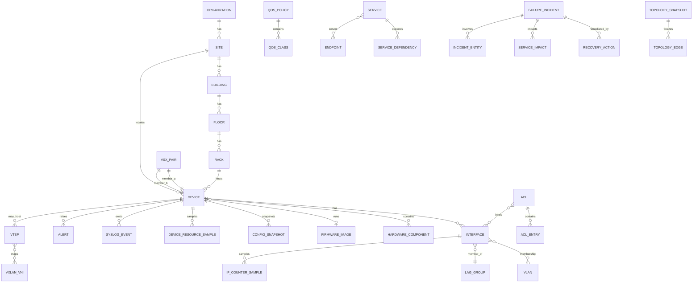

# A02 — Entity–Relationship Overview

## 1. Domain packages

| Package | Tables (core) | Role |
|---------|---------------|------|
| **ORG** | `organization`, `site`, `building`, `floor`, `rack` | Multi-site placement |
| **INVENTORY** | `device`, `device_role`, `hardware_component`, `firmware_image`, `access_point`, `radio` | Physical/logical inventory |
| **TOPOLOGY** | `interface`, `link`, `lag_group`, `lag_member`, `vsx_pair`, `topology_snapshot`, `topology_edge` | L1/L2 connectivity + versions |
| **OVERLAY** | `vlan`, `vlan_membership`, `vxlan_vni`, `vtep`, `evpn_instance`, `evpn_esi`, `mac_ip_binding` | L2/L3 virtualization |
| **ROUTING** | `routing_instance` (VRF), `ospf_process`, `ospf_interface`, `bgp_process`, `bgp_neighbor`, `static_route`, `bfd_session`, `rib_entry`, `fib_entry` | Control plane |
| **POLICY** | `acl`, `acl_entry`, `acl_binding`, `qos_policy`, `qos_class`, `qos_queue`, `qos_binding`, `stp_instance`, `stp_port` | Policy / loop prevention |
| **CONFIG** | `config_snapshot`, `config_object_diff`, `api_response_archive` | Versioned configuration & API |
| **TELEMETRY** | `if_counter_sample`, `device_resource_sample`, `env_sensor_sample`, `power_sample`, `nae_script`, `nae_agent`, `nae_monitor`, `nae_timeseries_point` | Metrics |
| **EVENTS** | `syslog_event`, `alert`, `event_correlation` | Discrete events |
| **FLOW** | `ipfix_exporter`, `ipfix_record`, `flow_aggregate_5m` | Flow analytics |
| **SERVICE** | `user_account`, `endpoint`, `application`, `service`, `service_dependency`, `service_endpoint_bind`, `sla_objective` | Business plane |
| **INCIDENT** | `failure_incident`, `incident_entity`, `recovery_action`, `service_impact` | Ground-truth ops labels |
| **LABEL** | `label_anomaly_window`, `label_failure_horizon`, `label_rca`, `label_impact`, `label_degradation`, `label_config_risk` | ML targets |
| **GRAPH** | `graph_node`, `graph_edge`, `graph_snapshot` | Materialized GNN views |

---

## 2. Cardinality highlights

```
organization 1──* site 1──* building 1──* floor 1──* rack 1──* device
device 1──* interface
device 0..1──0..1 access_point (AP as device subtype or linked)
interface *──* vlan (via vlan_membership)
interface *──1 lag_group (via lag_member)   [member ports]
device 2──1 vsx_pair
link connects exactly 2 interfaces (a_interface_id, b_interface_id)
device 1──* config_snapshot
device 1──* if_counter_sample (per interface)
failure_incident *──* device/interface/service (via incident_entity / service_impact)
failure_incident 1──* recovery_action
```

---

## 3. Relationship integrity rules

1. A `link` may exist only if both interfaces’ parent devices are in inventory and `link.valid_from` overlaps both interfaces’ validity.  
2. `vlan_membership` requires `vlan.site_id` compatible with `device.site_id` (or explicitly marked as DCI stretched VLAN with `stretch_domain_id`).  
3. `acl_binding` direction (`in`/`out`) must reference an existing interface or VLAN SVI.  
4. `vsx_pair` members must share `vsx_system_id` / ISL LAG reference.  
5. `evpn_esi` used only when `topology_profile` includes EVPN.  
6. `recovery_action.incident_id` mandatory; orphan recoveries forbidden.  
7. Label tables reference either `window_id` or `incident_id` and never invent entities outside inventory.

---

## 4. ER diagram (Mermaid)



---

## 5. Why relational *and* graph

| Consumer | Prefers | Reason |
|----------|---------|--------|
| Classical forecasting / tabular XGBoost | Relational samples + joins | Feature stores, SQL |
| GNN RCA / digital twin state | `graph_node` / `graph_edge` | Message passing on topology |
| XAI | Both | Trace prediction → entity keys → raw evidence rows |
| Autonomous agents | Events + config diffs + graph | Tool-using diagnosis |

The relational schema is authoritative; graph tables are **deterministic projections** of topology + selected dynamic attributes at snapshot time.
